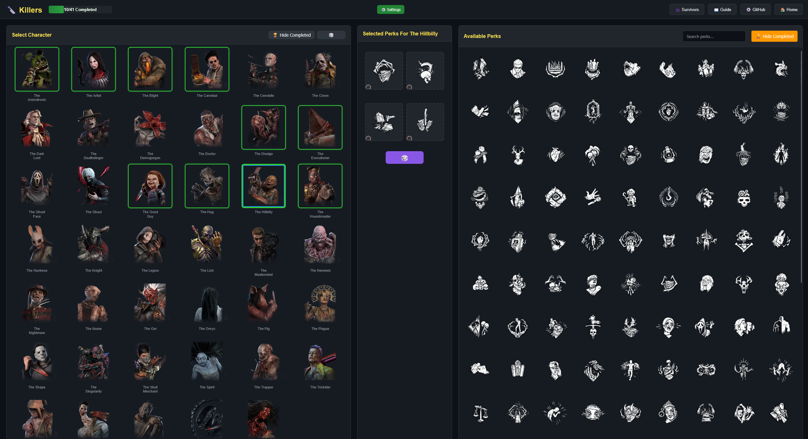
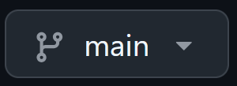

# All Perk Streak Tracker 🌟

Track every perk streak in Dead by Daylight (Killer + Survivor) with an easy self‑hosted web app and optional real‑time streamer overlay for OBS.

## Live Website 🔗
[allperkstreak.help](https://www.allperkstreak.help)



## Public Test Build 🧪

The latest Killers and Survivors are available in the `Public-Test-Build` branch.

<a href="https://github.com/autoamnesia/all-perk-streak/tree/Public-Test-Build">
  
</a>

## Features ✨
* Killer & Survivor progress tracking (perks + completion state)
* Save / restore progress file locally
* Persisted builds (keep perk builds for future runs)
* Randomizer for perks / killers
* Real‑time OBS overlay when using Node.js server
* Fallback “basic mode” using only Python / static hosting (no overlay APIs)

## Modes 🧪
| Mode | How | Requirements | Features |
|------|-----|--------------|----------|
| Streamer Mode (Recommended) | Run `start_server.bat` (auto-detects) | Node.js + Python 3.x | Full API endpoints, live overlay (`/streamer-overlay.html`), progress update endpoints |
| Basic Mode | Run `start_server.bat` with only Python present | Python 3.x | Static file serving only (no live overlay auto update) |


## Quick Start ⚡
1. Download or clone the repo
2. Install prerequisites:
   * [Node.js LTS](https://nodejs.org/en/download) (Windows Installer (.msi))
   * [Python 3.x](https://www.python.org/downloads/) (check “Add to PATH”)
3. Double‑click `start_server.bat`
4. Open: http://localhost:8000
5. (Streamer) Add Browser Source in OBS → URL: `http://localhost:8000/streamer-overlay.html`
6. Keep the server window open while tracking

## Streamer Overlay Setup 📺
See the full step‑by‑step guide in `http://localhost:8000/streamer-setup.html` once the server is running).


## Adding New Content 📦
You can independently extend Killers, Survivors, and Perks.

1. Get the icon as `.webp` (transparent preferred)
2. Place it correctly:
   * Killers → `assets/characters/killers/`
   * Survivors → `assets/characters/survivors/`
   * Perks → `assets/perks/killers/` or `assets/perks/survivors/`
3. Edit `characters.json` (follow existing object shape). Typical fields:
   ```jsonc
   {
     "name": "The Example",
     "type": "killer", // or "survivor"
     "image": "assets/characters/killers/the-example.webp"
   }
   ```
4. Refresh the page (hard refresh Ctrl+F5 if cached)

## Randomizer 🔀
The random button selects a new perk combination from the currently available pool.

## Troubleshooting 🔍
| Issue | Fix |
|-------|-----|
| Overlay blank | Open http://localhost:8000 directly – if that works, re‑add OBS Browser Source & tick “Refresh when scene becomes active”. |
| Port already in use | Close other local dev servers or change `PORT` constant in `server.js`. |
| Progress not saving | Ensure the window running Node isn’t closed; check write permission for `progress.json`. |
| Icons not showing | Confirm path + file extension + cleared browser cache. |
| CORS errors opening file directly | Use the local server instead of opening `index.html` from the filesystem. |

## Contributing 🤝
* Open issues for bugs / feature ideas

## Roadmap (Ideas) 🗺️
* Mobile Support
* More overlay customization (font, layout toggles)
* Add on selection

## Credits 🙏
Forked from [T5K](https://github.com/Pokejongen) – huge thanks for the original foundation.
